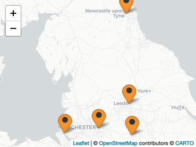

<!-- README.md is generated from README.Rmd. Please edit that file -->

# Welcome to the **N8 CIR ‘Northern Tour’ ReproHack series**\!

 

#### :date: **21 Jan - 12 Mar 2020**

#### :alarm\_clock: **10:00am-17:00pm**

##### :round\_pushpin: **Multiple locations**

##### :earth\_africa: **Newcastle, York, Leeds, Sheffield, Manchester**

-----

 

We are all excited by the progress made by many authors to **make their
papers reproducible by publishing associated code and data**.

We know how challenging it can be so we **want to showcase the value of
the practice**, both for original authors and as a learning experience
for those who attempt to reproduce the work.

It’s imperative to note that **ReproHacks are by no means an attempt to
criticise or discredit work**. We see reproduction as **beneficial
scientific activity in itself**, with useful outcomes for authors and
valuable learning experiences for the participants and the research
community as a whole.

-----

## **Two ways to get involved:**

### **[Nominate a paper](https://forms.gle/vMk25vCevMg2QiYQ9)**

We invite nominations for papers that have both associated **code** and
**data** publicly available. We also encourage analyses based on open
source tools as we cannot guarantee participants will have access to
specialised licenced software.

[**Current list of proposed papers and
projects**](https://sheffield-university.shinyapps.io/n8cir-reprohacks/)

 

Join us at the hack to **dig into exciting science**, learn more about
**reproducibility**, working with **other people’s code and data** and
more\!

-----

## **On the day**

### Materials

  - [**Intro
    Slides**](https://annakrystalli.me/n8cir-reprohacks/slides/#1)
    Instructions and links
  - [**Paper
    list**](https://sheffield-university.shinyapps.io/n8cir-reprohacks/)
    List of submitted papers
  - [**Hackpad**](https://bit.ly/remote-reprohack-hackpad) Event
    collaborative notebook
  - [**Feedback form**](https://forms.gle/wvXfjNT7HbkqH2Rj7) Record
    feedback for authors

This is the master repo of the hack. We’ll collect information on the
teams and projects, track discussions and collaborative notes on the
event [**hackpad**](https://bit.ly/remote-reprohack-hackpad)

As all ReproHack events, we strive to make this event open and inclusive
to all. As such the event is governed by the [ReproHack Code of
Conduct](https://github.com/reprohack/reprohack-hq/blob/master/CODE_OF_CONDUCT.md)
and you should read it before participating. By participating, you are
expected to uphold this code.

### **Authors**

We encourage authors that are keen, to be available for participants to
reach out to for guidance or even just to say hello\! You can do so by
joining the **`review-chat`** channel in our
[**slack**](https://reprohack-autoinvite.herokuapp.com/) group. We’ve
also set up an **`authors`** channel in our
[**slack**](https://reprohack-autoinvite.herokuapp.com/) group as a
place where you can also reach the organisers prior to the hack. You can
also start discussions or add comments through our collaborative
[**hackpad**](https://bit.ly/remote-reprohack-hackpad).

### **Participants**

#### **Introduction & Welcome** [slides](https://annakrystalli.me/n8cir-reprohacks/slides/#1)

#### **1. Paper review and team formation**

We’ll start with a brief review of the [**papers
proposed**](https://sheffield-university.shinyapps.io/n8cir-reprohacks/)
and then form into teams. Feel free to work on your own if you prefer
but we highly recommend you discuss your experiences with fellow
participants as you work.

#### **2. Select and register a paper**

  - Add your details in the **participants** section of the
    [**hackpad**](https://bit.ly/remote-reprohack-hackpad) so we have a
    complete list of participants.

  - In your teams **decide which paper** you wish to work on.

  - **Register your team and paper** by logging the title of the
    selected paper and the name(s) of the reviewer(s) in the
    [**hackpad**](https://bit.ly/remote-reprohack-hackpad). You can use
    the following template:
    
        ### **Paper:** <Title of the paper reproduced>
        **Reviewers:** Reviewer 1, Reviewer 2 etc.

#### **3. Work on your paper\!**

Follow any instructions/documentation associated with the papers and try
and reproduce the work. As you work through your paper, keep in mind the
main points on which feedback to the authors will provided, **Access**,
**Reproducibility**, **Documentation** and **Reusability**. It might
help to have a look at the [feedback
form](https://forms.gle/wvXfjNT7HbkqH2Rj7) before you begin and keep
notes during. Feel free to use the event hackpad to record general
findings you wish to share with the group.

We’ll **come together during the day** to discuss progress and
troubleshoot any sticking points.

Should you finish reproducing your paper quickly, feel free to explore
the work more deeply. For example, you could try and run additional
analyses, create new plots or even combine materials with your own or
other open materials available on the web\!

You might want to consider attempting to **replicate** the results, for
example, if the code is in R consider translating the analysis to python
and examining whether you are getting the same results. Such a
contribution would be appropriate for publication in the **ReScience C**
journal\! Have a look at the journals
[website](http://rescience.github.io/write/) for further details.

Should you produce any additional materials relating to your
reproduction during the session, we ask that you **share it publicly**
and **add any links to such materials to the hackpad**.

#### **4. Leave feedback for the authors**

Please complete the [**Reproducibility feedback
form**](https://forms.gle/wvXfjNT7HbkqH2Rj7). Please also remember to be
kind and constructive. Reproducibilty is hard and all authors submitting
their papers have been incredibly brave. Here’s an
[example](https://github.com/annakrystalli/write-ups/blob/master/assets/OpenCon_ReproHack%20feedback_form.pdf)
of feedback to authors.

#### **5. Feedback to the group on your experiences**

You can use the hackpad to take notes and summarise your experiences.

#### **Closing Remarks**

-----

#### Collaborative note taking:

Feel free to contribute any additional thoughts on our collaborative
[**hackpad**](https://bit.ly/remote-reprohack-hackpad). These can help
form the basis for a blogpost on the
event.

 This
work is licensed under a
<a rel="license" href="http://creativecommons.org/licenses/by/4.0/">Creative
Commons Attribution 4.0 International License</a>.
