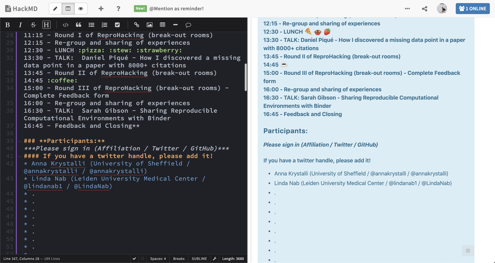

class: inverse


```{r xaringan-themer, include = FALSE}
library(xaringanthemer)

style_duo_accent(primary_color = "#2D896B", secondary_color = "#46CC97",
  header_font_google = google_font("Fira Sans", "700"),
  text_font_google   = google_font("Lato", "300", "300i"),
  code_font_google   = google_font("Source Code Pro"),
  title_slide_text_color = "white",
  background_color = "white",
  black_color = "#2a332c",
  title_slide_background_image = "assets/background.jpg"
)
```


## Welcome to the N8 CIR Remote ReproHack!
### ***Part of the "Northern Tour" Series***
<!-- Put the link to this slide here so people can follow -->

***

### Event Hackpad: 
### [bit.ly/remote-reprohack-hackpad](https://bit.ly/remote-reprohack-hackpad)

Contains all event information and links to materials


### `r emo::ji("wave")` from the whole ReproHack team

#### _Anna, Daniela, Florencia, Linda, Paloma, Ricci_

---

## ReproHack hackpad `r emo::ji("right_arrow")`   [hackmd.io](https://hackmd.io/s/features) notepad


```{r, echo=FALSE, out.width="90%"}

```


---
class: inverse, center, middle

# Agenda

---

### Morning

**10:00 Welcome**
- **Intro to Blackboard Collaborate**
- Ice breaker (split into rooms)

**10:20 `r emo::ji("loudspeaker")` Daniel Nüst** ***Research compendia enable code review during peer review*** 

**10:40 Introduction & tips for reviewing**


***11:00 Reprohack***
- **Review list, form groups, select papers (break-out rooms)**
- **COFFEE BREAK** 
- Work on papers 

---

### Lunchtime

**12:15 Regroup: get someone from each group to tell us a bit about their experiences.**

**12:30 LUNCH BREAK**

**13:30 `r emo::ji("loudspeaker")` Daniel Pique -** ***How I discovered a missing data point in a paper with 8000+ citations***

***13:45 Reprohack***
- Work on papers (break-out rooms)

---

### Afternoon
***Reprohack***

- Work on papers (break-out rooms)
- 14:45 COFFEE BREAK `r emo::ji("house")` `r emo::ji("coffee")`
- Work on papers - **Complete feedback form**

**16:00 Regroup - get someone from each group to tell us a bit about their experiences.**

**16:30 `r emo::ji("loudspeaker")` Sarah Gibson -** ***Sharing Reproducible Computational Environments with Binder***

**16:50 Closing**


---
class: inverse

# House Keeping:

***

## Tour of Blackboard Collaborate

> ### Linda Nab


---
class: inverse

## Welcome back!

***

# Ice breaker:  Introductions

<!-- Use this section as an ice-breaker. Introduce yourself, then allow others to 
go around the room and introduce themselves too -->

---

<!-- Add details about yourself the organiser here: -->

## Who am I?

> ### Dr Anna Krystalli (@annakrystalli)
> 
> - Research Software Engineer _University of Sheffield_
>
> - 2019 Fellow _Software Sustainability Institute_
>
> - Software Peer Review Editor _rOpenSci_ 
>
> - Co-organiser _Sheffield R Users Group_

---

## Why am I here?

> I believe there's lots to learn about Reproducibility from working with other people's materials and engaging with real published research code and data.

---

## Who is my favorite animated character?

> Stitch!
>
> 


---
class: inverse

# Let's hear from the ReproHack Team!

---

<!-- Open it up to participants -->
# Your turn

### in break-out rooms (7 mins)

> - ### Who are you?

> - ### Why are you here?

> - ### Who is your favorite animated character?

--

### As a group

> ### Name your room! `r emo::ji("snow-capped mountain")``r emo::ji("camping")``r emo::ji("desert")``r emo::ji("roller_coaster")``r emo::ji("national_park")``r emo::ji("stadium")``r emo::ji("castle")``r emo::ji("Tokyo_tower")``r emo::ji("sunrise")``r emo::ji("desert_island")`


---
class: inverse

## `r emo::ji("loudspeaker")` Daniel Nüst  
#### _Researcher at Spatio-temporal Modelling Lab at the Institute for Geoinformatics (ifgi) at the University of Münster. _

<br>

> ### *"Research compendia enable code review during peer review"*

---
class: inverse

## Welcome back!

***

# Tips for Reproducing & Reviewing

---

## ReproHack Objectives

1. **Practical Experience in Reproducibility**

3. **Feedback to Authors**

5. **Think more broadly about opportunities and challenges**


---


.pull-left[

## Code of Conduct

Event governed by **ReproHack Code of Conduct** [bit.ly/reprohack-coc](https://bit.ly/reprohack-coc)

```{r, echo=FALSE}
knitr::include_graphics("assets/1728_TURI_Book sprint_7 community_040619.jpg")
```

]


--
.pull-right[
### Additional Considerations

- #### Reproducibility is hard!
- #### Submitting authors are incredibly brave!

### Thank you Authors! `r emo::ji("raised_hands")` 

- #### Without them there would be no ReproHack.
- #### Show gratitude and appreciation for their efforts. `r emo::ji("pray")` 
- #### Constructive criticism only please!

]
---
class: inverse, center, middle

# `r emo::ji("mag")` Reproducing & Reviewing


```{r, echo=FALSE, out.width="70%"}
knitr::include_graphics("assets/Hackathon.jpg")
```

---

## Selecting Papers

.pull-left[
- **Information submitted by authors:**

  - Languages / tools used
  
  - Why you should attempt the paper.
  
- **No. attempts `r icon::fa('recycle')`** No. times reproduction has been attempted

- **Mean Repro Score `r icon::fa('check-circle')`** Mean reproducibility score (out of 10)

    - lower == harder!
    
- Register paper using template in hackpad:
    ```
    ### **Paper:** <Title of the paper reproduced>
    **Reviewers:** Reviewer 1, Reviewer 2 etc.
    ```
]


.pull-right[
```{r, echo=FALSE}
knitr::include_graphics("assets/ReprohackPickPapers.jpg")
```
]


---
class: inverse, center, middle

# Review as an auditor `r emo::ji("bookmark_tabs")`


--

#### **tl;dr: Don't be this guy!**

```{r, echo=FALSE, out.width="60%"}
knitr::include_graphics("https://www.reactiongifs.com/r/O_o.gif")
```


---
class:centers

# `r emo::ji("mag")` For FAIR materials

```{r, echo=FALSE, out.width="80%"}
knitr::include_graphics("assets/FAIRPrinciples.jpg")
```

---

.pull-left[

# Access

- How **easy** was it to **gain** access to the materials?

- Did you manage to download all the files you needed?

]

--

.pull-right[

# Installation

- How **easy / automated** was **installation**?

- Did you have any problems?

- How did you solve them?
]

--- 
---

.pull-left[


# Data

- Were **data clearly separated from code and other items**?

- Were **large data files deposited in a trustworthy data repository** and referred to using a **persistent identifier**?

- Were **data documented** ...somehow...

]

--

.pull-right[

# Documentation

Was there **adequate documentation** describing:
- how to **install** necessary software including non-standard dependencies?

- how to **use** materials to reproduce the paper?

- how to **cite** the materials, ideally in a form that can be copy and pasted?

]
---

.pull-left[

# Analysis

- **Were you able to fully reproduce** the paper? `r emo::ji("white_check_mark")`

- **How automated** was the process of reproducing the paper?

- **How easy was it to link** analysis **code** to:
   - the **plots** it generates
   - **sections in the manuscript** in which it is described and results reported
]
--

.pull-right[

<br>

### If the analysis was not fully reproducible `r emo::ji("no_entry_sign")`
 - Were there **missing dependencies?**
 
 - Was the **computational environment not adequately described** / captured?
 
 - Was there **bugs** in the code?
 
 - Did **code run but results (e.g. model outputs, tables, figures) differ** to those published? By **how much?**
]

---
class: inverse, center, middle

# Review as a user `r emo::ji("video_game")`

--

.pull-left[

### New User

```{r, echo=FALSE, out.width="80%"}
knitr::include_graphics("https://25.media.tumblr.com/30906cccedfe97a3d5450a23359ca298/tumblr_ml72i2eL6t1rsudnqo1_500.gif")
```


]

--

.pull-right[

### Invested User

```{r, echo=FALSE, out.width="80%"}
knitr::include_graphics("https://media.giphy.com/media/9K2nFglCAQClO/source.gif")
```


]


---
## Review as a user `r emo::ji("video_game")`

<br>

#### What did you find easy / intuitive?
> Was the file structure and file naming informative / intuitive?
> Was the analysis workflow easy to follow? 
> Was there missing / confusing documentation?


#### What did you find confusing / difficult
> Identify pressure points. Constructive suggestions?


#### What did you enjoy?
> Identify aspects that worked well.

---
class: inverse, center, middle

# Feed back

# `r emo::ji("speech_balloon")`

---


## Feedback as a community member

.pull-left[

#### Acknowledge author effort

#### Give feedback in good faith

#### Focus on community benefits and system level solutions


```{r, echo=FALSE, out.width="80%"}
knitr::include_graphics("assets/1728_TURI_Book sprint_11 community_040619.jpg")
```

]
.pull-right[

> #### _Help build convention on what a Research Compendium should be and how we should be able to use it_

```{r, echo=FALSE, out.width="80%"}
knitr::include_graphics("assets/ResearchCompendium.jpg")
```


]

---
class: inverse, center, middle

# Additional activities

---

## Finished early?

### Explore the work more deeply:

- Try and run additional analyses.

- Create new plots. 

- Combine materials with your own or other open materials available on the web!

---


### Participation guidelines

#### During talks information sessions and regroups
- Please stay on mute until you are invited to speak.
- Add questions for speakers on the hackpad

#### During break out work 
- Try and engage as much as possible.
- Feel free to mute, turn off camera and disconnect if you need to.
- Feel free to move around and go say hello or help out in other rooms.
- We encourage discussions in the break-out rooms but be mindful of others trying to work. The **main room** and **cafe** are always available for hanging out.

### At any time
- Feel free to add to the collaborative notes on the hackpad
- Contact facilitators through the main chat


---
class: inverse

# Let's go! `r emo::ji("checkered_flag")`

## 11:00 - 11:15

### `r emo::ji("mag_right")` Paper List review

+ Have a look at the papers available for reproduction


### `r emo::ji("busts_in_silhouette")` Team formation / project registration

+ Fine to work individually
+ Add your details to the [**hackpad: bit.ly/remote-reprohack-hackpad**](https://bit.ly/remote-reprohack-hackpad).
+ Register your team and paper on the [**hackpad: bit.ly/remote-reprohack-hackpad**](https://bit.ly/remote-reprohack-hackpad)

### `r emo::ji("house")``r emo::ji("coffee")`Grab a coffee! 

---
class: inverse

## 11:15 - 12:15 `r emo::ji("computer")` ReproHack I 
### (break-out rooms) 

Work on your papers. Feel free to discuss papers and collaboratively troubleshoot problems. Reach out through the main chat for help outside the group. Feel free to move groups or hang out in the main *room* or *cafe.* 

> ### Before Lunch-time Regroup `r emo::ji("thought_balloon")`
> #### Summarise group experiences
> - What approaches to reproducibility the papers taken.
> - Anything in particular you like about the approaches so far?
> - Anything you're having difficulty with?

---
class: inverse

## 12:15 - 12:30 `r emo::ji("speech_balloon")` Lunch regroup 

### Welcome back

***

### Feedback group experiences

---
class: inverse

## 12:30 - 13:30 `r emo::ji("green_salad")``r emo::ji("burrito")` LUNCH 

Feel free to disconnect or hang out in the main *room* or *cafe.* 

### Be back for the Second talk at 13:30

---
class: inverse

## `r emo::ji("loudspeaker")` Daniel Pique  

> ### *"How I discovered a missing data point in a paper with 8000+ citations"*


---
class: inverse

## 13:50 - 16:00  `r emo::ji("computer")` ReproHack II & III 
### (break-out rooms) 

### 14:45 - 15:00 COFFEE BREAK `r emo::ji("house")``r emo::ji("coffee")`

Work on your papers. Feel free to discuss papers and collaboratively troubleshoot problems. Reach out through the main chat for help outside the group. Feel free to move groups or hang out in the main *room* or *cafe.* 

> ### Before Final-time Regroup `r emo::ji("thought_balloon")`
> #### Complete author feedback form `r emo::ji("writing_hand")`
> - Discuss how you got on with your papers?
> - Summarise final experiences of the group in hackpad

---
class: inverse

## 16:00 - 16:30 Final regroup `r emo::ji("speech_balloon")`

- So, how did the groups get on? 

- Final comments.


- On hackpad: **Feedback**
  + One thing you liked
  + One thing that can be improved.

---
class: inverse

## `r emo::ji("loudspeaker")` Sarah Gibson  
### _Research Software Engineer at the Alan Turing Institute_

<br>

> ### *"Sharing Reproducible Computational Environments with Binder"*

---
class: inverse, center, middle

# Closing Remarks


---
class: inverse, center, middle

# Resources

---

## Resources

- [**The Turing Way**](https://the-turing-way.netlify.com/introduction/introduction): a lightly opinionated guide to reproducible data science.

- [**Statistical Analyses and Reproducible Research**](): Gentleman and Temple Lang's introduction of the concept of Research Compendia

- [**Packaging data analytical work reproducibly using R (and friends)**](https://peerj.com/preprints/3192/): how researchers can improve the reproducibility of their work using research compendia based on R packages and related tools

- [How to Read a Research Compendium](https://arxiv.org/pdf/1806.09525.pdf): Introduction to existing conventions for research compendia and suggestions on how to utilise their shared properties in a structured reading process.

- [Reproducible Research in R with rrtools](https://annakrystalli.me/rrtools-repro-research/): Workshop: Create a research compendium around materials associated with a published paper (text, data and code) using `rrtools`.  
  - [**Example Compendium**](https://github.com/annakrystalli/rrcompendiumDTB): Demo Research compendium.

---
## Did you enjoy ReproHacking?

# Get involved!


### [reprohack/reprohack-hq](https://github.com/reprohack/reprohack-hq) GH repository

#### Check out our [issues](https://github.com/reprohack/reprohack-hq/issues)


#### Chat to us:

[](https://reprohack-autoinvite.herokuapp.com/)


### Host your own event!
### Submit your own papers!

---
## Many ways to ReproHack!


```{r, echo=FALSE, out.width="80%"}
knitr::include_graphics("assets/workflow.png")
```


---

# THANK YOU ALL! `r emo::ji("pray")`

- ### Thank you PARTICIPANTS for coming!
- ### Thank you AUTHORS for submitting!
- ### Thank to the N8 CIR for sponsoring!


# `r emo::ji("wave")`

---

# Acknowledgements

Images throughout the slides watermarked with **Scriberia** were created by [Scriberia](https://www.scriberia.co.uk/) for The Turing Way community and is used under a CC-BY licence 
- _The Turing Way Community, & Scriberia. (2019, July 11). Illustrations from the Turing Way book dashes. Zenodo. http://doi.org/10.5281/zenodo.3332808_
